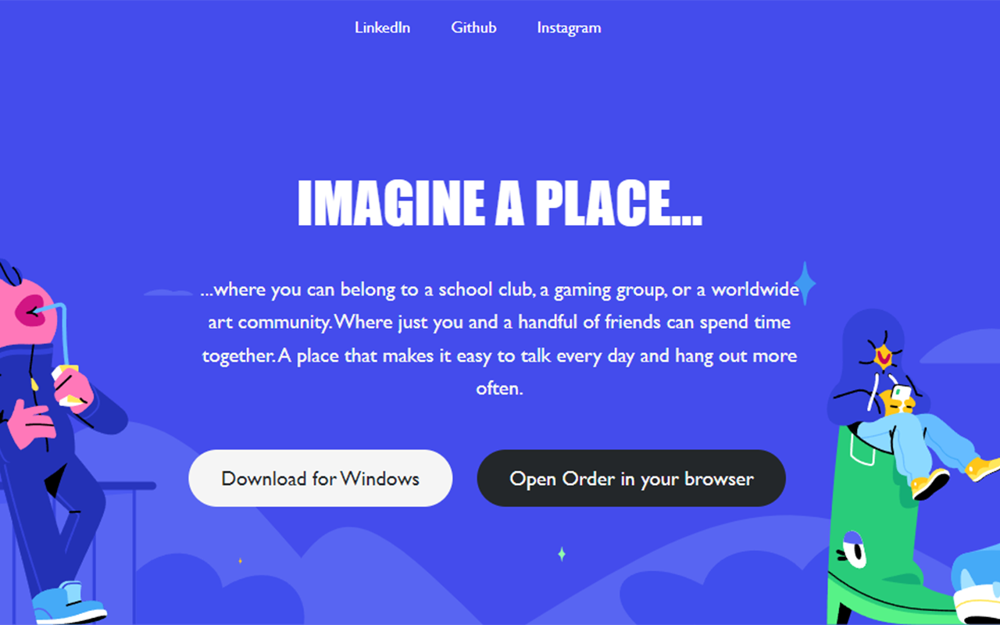

# Hi, I'm Andrew 🌱</b>

- ✨ Web Dev Pro and AppAcademy Alum
- 🔭 I’m currently learning Python
- 💬 Ask me about Algorithm Visualizations
- ⚡ Fun fact: I'm trying to build my own smart mirror. Wish me luck!
- 😄 Pronouns: He/him/his

 
 

## Checkout My Personal Site!:

 
 

## Checkout Down and Dandy!:

  

 
 

## Checkout Order!:

  
  
 
 

## Checkout Pictophone!:

  

 
 

## Connect with me:

  
  

   
   

 ## Languages and Tools:

 

## My Github Stats:

 

 
<!--
  -->
 

 

 

